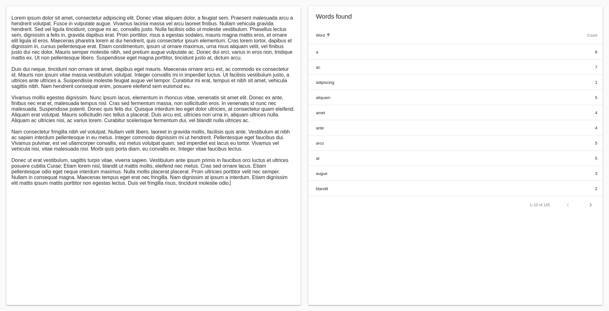

# Flutter Word Counter

A simple word counter designed to be run on the web. It contains a text area and a data table to display the found words and their counts. It was developed using the Flutter framework and built using the [web support](https://flutter.dev/web).

Live preview: https://word-counter-flutter.herokuapp.com/

Inspired by: https://github.com/florinpop17/app-ideas/blob/master/Projects/1-Beginner/Word-Frequency-App.md

